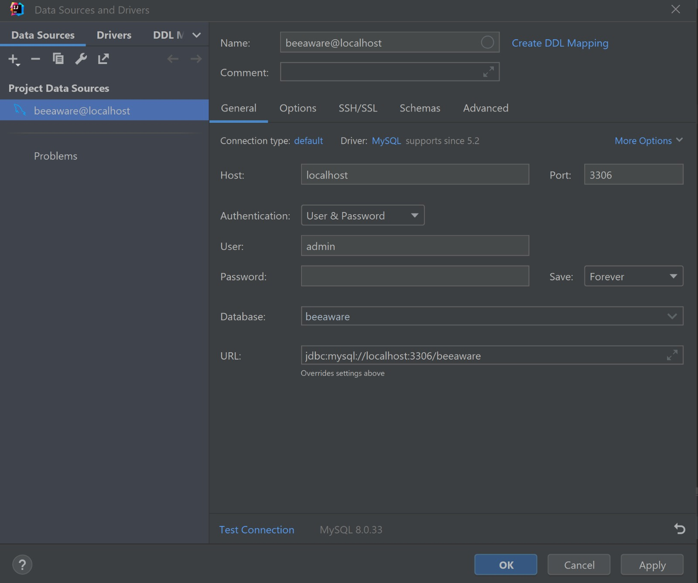

# BeeAware-Service
## App SOAR 2024

### Pollenic Allergy Monitoring Platform
Allergies affect a large portion of the population, and their symptoms can be
exacerbated by various environmental factors, including weather conditions.
The platform's goal is to provide users with a channel for information on
high-risk periods based on daily pollen forecasts to help them anticipate
potential symptoms. Additionally, it will allow users to log their perceived
symptoms daily on a subjective scale so they can compare these symptoms with
the pollen load index. Users can also record days when an antihistamine was
taken to observe its impact on symptoms. All this information will be grouped
in a graph, providing users a simple and effective visualization tool to review
their personal history, helping them act accordingly or discuss with a healthcare
professional. The platform will rely on a Google Pollen API for pollen load
forecasts to retrieve pollen indices based on the user's specified location.

### Getting Started

To initialize the service project follow these steps:
1. **Create an `application.properties` file**:
    - Place this file in the `/resources` directory.
    - Add your Google API_KEY (for the Google Pollen API) in the file.

    Example: `BeeAwareService/src/main/resources/application.properties`
   ```properties
    API_KEY='YOUR_GOOGLE_API_KEY_HERE'
    ```

2. **Docker Configuration**:
    A Docker configuration is available if you want to try the service without
    installing Payara.
   - Simply navigate to the `BeeAwareService/docker` directory.
   - And run the following command:
    ```shell
    docker-compose up
    ```

3. **Testing the API**:
   - A Postman configuration file is provided to test the API with all our endpoints.
   - You can find the file at:
      `BeeAwareService/BEEZZER_SERVICE.postman_collection.json`

4. **Maven Dependencies**:
   This project uses Maven for dependency management. The key dependencies included in
   the `pom.xml` are:
     - *Lombok*: Ensure that the Lombok plugin is installed and enabled in your IDE.
     - *Mockito*: The Byte Buddy library used internally by Mockito does not support Java 23.
      Byte Buddy's maximum officially supported version in this case is Java 21.

5. **Authentication Endpoint**:
   - When first opening you are attributed an ADMIN role throughe token so you don't need to authenticate.
   For each call make sure that in the authorization tab you selected "Inherit auth from parent".

6. **Download Symptoms Excel Endpoint**:
   - In Postman, in the Excel endpoint you need to "send & download" in order to download correctly the Excel file.

### Core Service Components

1. **BeezzerService**:
    - Core processing service for aggregating data and providing user-centric functionalities.

2. **GeoApiService**:
    - Manages interactions with the Google Maps API.

3. **ForeCastService**:
    - Handles the retrieval and processing of pollen forecasts with the Google Pollen API.

## Docker Initialization

**Important!**: Check that your MySQL port is not running the port: 3306 before proceeding with the bellow instructions:  
1) Open your Docker Environment  
2) Open the following file [`docker/docker-compose.yaml`](./docker/docker-compose.yaml)
3) Run the services (line 2 of the above file)  
4) When you first try to access the Payara Admin Console (http://localhost:4848/)  
   username : admin  
   password : secret
  
5) Run the Payara 6.20.0 server  
   username : admin  
   password secret
   Check -> Use SSL Connection  

6) Connect the Data source MySQL  
   Database: beeaware
   username : admin
   password secret
   
7) You can find the username, passwords, port, etc... information bellow  
   
